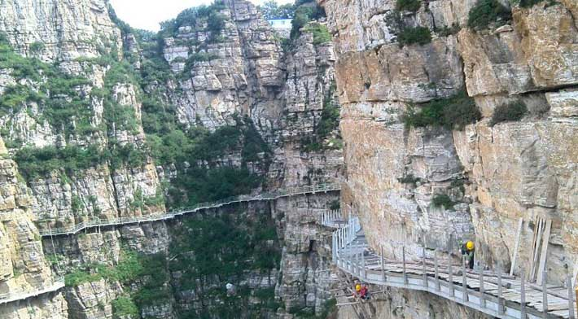
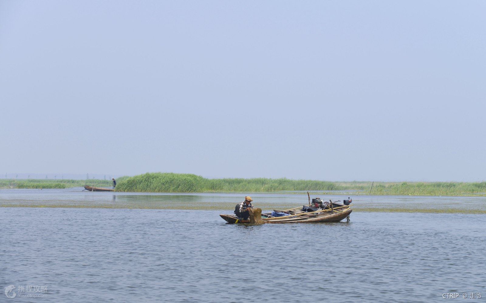
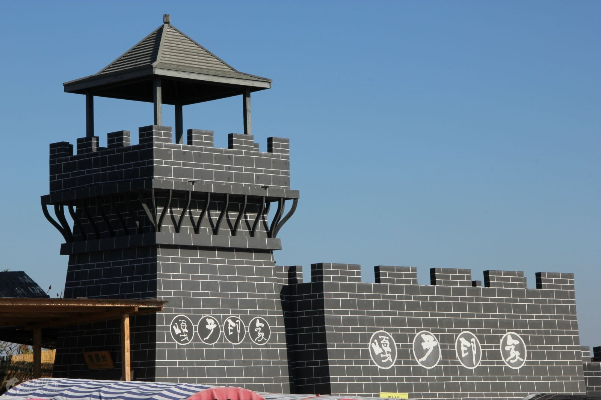
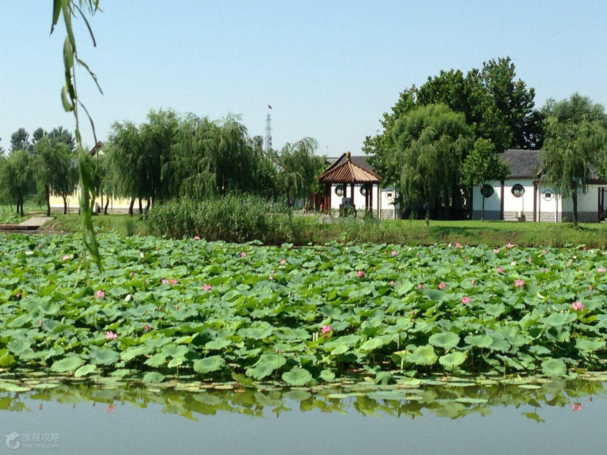
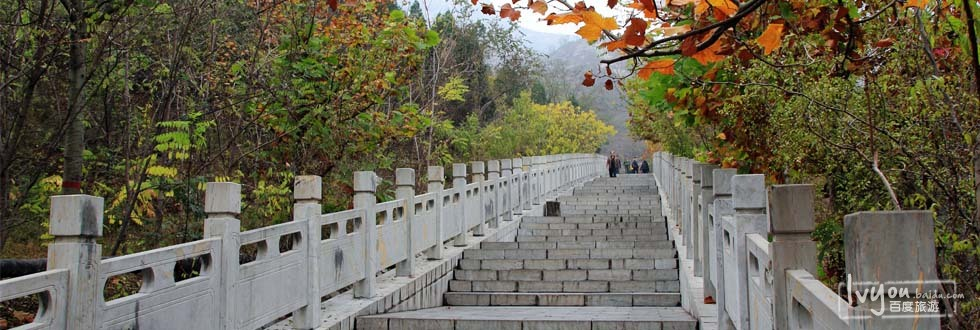

# 保定三日游

## 吃喝篇

## 玩乐篇

### 白石山国家地质公园

- **简介**

  白石山国家地质公园 (Molmt Baishishan national geopark) 位于河北省涞源县，面积 60 平方千米。以白石山大理岩峰林为特征，辅以十瀑峡花岗岩瀑布群和拒马源构造泉群等地质遗迹。白石山险峰林立，峭壁深谷，怪石峥嵘，其大理岩构造峰林，是地质地貌景观的一种新类型。

- **类别**

  山峰，大理岩构造峰林。

- **门票**

  150元。

- **交通**

  130.4公里，2小时52分钟，打车约293元，途经：S332、锡海线。

  

- **景色**

  

  

  

  

  

  ​
### 白洋淀

- **简介**

  在华北平原上，有一个美丽的地方，那就是白洋淀。白洋淀由九十多个浅水湖组成，湖边长满了芦苇。大大小小的村子就分散在相连的河淀上。这一切构成了一幅美丽的图画。 夏天，整个淀区芦苇密布，一望无边，像是绿色的海洋。湖面上一片片荷叶挨挨挤挤，一枝枝荷花摇摇摆摆。那些荷花有白的，有粉的，还有红的，真好看！湖中心，渔舟三五成群。渔民们一会儿张网，一会儿收网，那些网就在湖中上下翻飞。等到鱼儿满舱的时候，渔舟就一个跟着一个向村边划去。 到了收苇子的时节，妇女们就忙起来。成捆的苇子堆满了院子。她们席地而坐，说笑着，编织着。一根根苇篾在她们手下飞起来，一张张苇席从她们手中编出来。白洋淀的苇席精美、结实，远近闻名。人们都把白洋淀称为“华北明珠”。这里每年都吸引了很多中外游人。

- **类别**

  乡村，湖泊。

- **门票**

  40元。

- **交通**

  52.0公里，1小时11分钟，打车约116元，途经：白洋淀大道、S334。

  

- **景色**

  

  

  

  

  

  

  

  

  

  

### 抱犊寨风景区(南天门在此)

- **简介**

  抱犊山，旧名萆山， 抱犊寨不是一个村庄，而是一座名山的名称。它位于鹿泉区境内，东距省会石家庄仅16公里，是一处集自然景观与人文景观于一地的旅游景区。2001年11月，抱犊寨景区被国家旅游局评定为“4A”级景区。

  抱犊寨属于 国家4A级景区抱犊寨是一处集历史人文和自然风光为一体的名山古寨。海拔580米，四周悬崖绝壁，顶部平旷坦夷，有肥沃良田660亩，土层深达66米。曾是汉淮阴侯韩信“背水一战”的古战场，亦是著名道人张三丰成道涉足之福地，其风光奇异独特，景色宜人，被誉为“天堂之幻觉，人间之福地，兵家之战场，世外之桃花源”的天下奇寨。

- **类别**

  山峰。

- **门票**

  50元。

- **交通**

  从保定出发，2小时2分钟，155.4公里，途经：京港澳高速、新元高速。

  

  从石家庄出发，1小时，23.2公里，途经：新华路、龙泉东路。

  

- **景色**

  
  
  
  
  
  
  
  
  
  
  
  
  
  
  
  
  

### 新景点

- **简介**
- **类别**
- **门票**
- **交通**
- **景色**